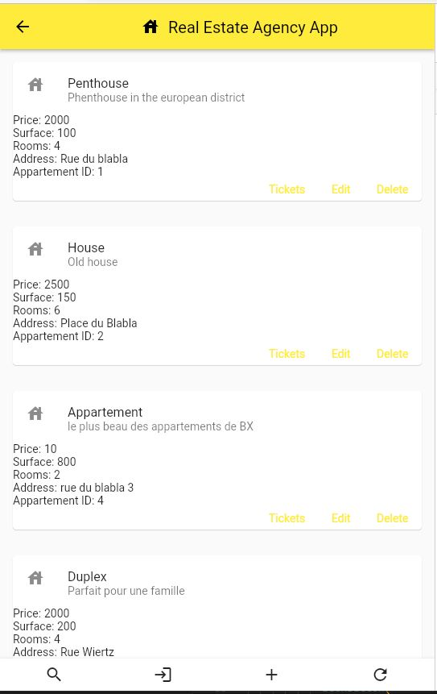
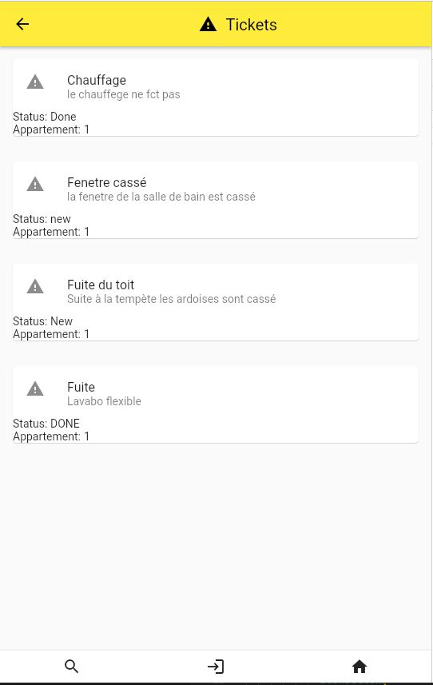
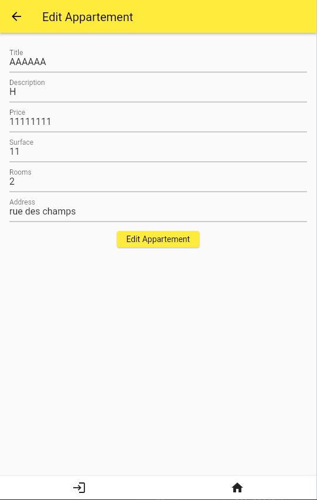

# Projet-Web-architecture-Agence-Immobiliere & Mobile-application
Dans le cadres des cours de 4ème année à l'ECAM, Il à été décider de grouper les cours d'architecture Web et 
de développement mobile, concrètement le projet Web et mobile utilisent la même API et le même serveur backend.

Le projet est une agence immobilière qui permet de gérer des biens immobiliers et des Locataires.
Il est possible de : 
- créer, modifier, supprimer un bien immobilier
- créer, modifier, supprimer un locataire
- créer, modifier un ticket de maintenance
- créer, supprimer un devis lié à un ticket

lien vers l'API : https://app.swaggerhub.com/apis/LeTouristeDeLECAM/Agence_Immobiliere/1.0

Les spécifications du projet sont disponibles dans le dossier `documentation`

## Web Architecture
Enseignant : Mr Dekimpe 

N° cours : 4eiaw40 

Crédit : 4 ECTS 

Descriptif des attentes du cours : https://plus.ecam.be/public/fiche/2022/4eiaw40

### Backend
Path : `WEB\BackEnd`

run : `nodemon server.js run`

### Frontend
Il existe deux frontend :
- Angular : Page web
- Ionic : Application mobile

#### Angular
Path : `WEB\FrontEnd\real_estate_angular`

run : `ng serve`

#### Ionic
PWA

Path : `WEB\FrontEnd\real_estate_ionic`

run : `ionic serve` ou `ionic serve --lab`

## Mobile Application
Enseignant : Mr Lurkin

N° cours : 4eiam40

Crédit : 3 ECTS

Descriptif des attentes du cours : https://plus.ecam.be/public/fiche/2022/4eiam40

Instructions du projet: https://quentin.lurkin.xyz/courses/mobile/project2023/index.html
 
Projet réalisé avec Flutter.
Path : `Mobile application\real_estate`

commande : `flutter run`

Preview :

Home Page

Ticket List Page

Edit Page

